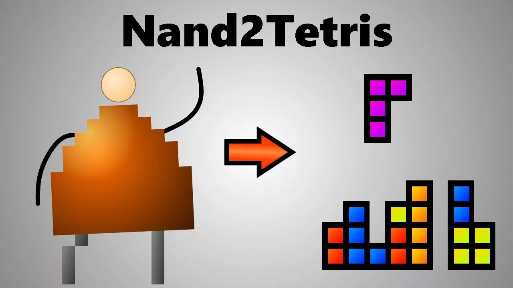

# [Nand2Tetris](https://www.nand2tetris.org)
    From Nand to Tetris
    The Elements of Computing Systems
    Building a Modern Computer From First Principles
    By Noam Nisan and Shimon Schocken (MIT Press)

В этом репозитории я сохраняю свои работы в ходе прохождения курса [Nand2tetris](https://www.nand2tetris.org), основанного на книге [The Elements of Computing Systems: Building a Modern Computer From First Principles](https://cmls-global.com/wp-content/uploads/2021/08/The-elements-of-computing-systems-building-a-modern-computer.pdf), в рамках которого мы с нуля создадим 16-битный компьютер, способный запустить тетрис. Спасибо [Ноаму Нисану](http://www.cs.huji.ac.il/~noam/) и [Шимону Шокену](http://www.shimonschocken.com/) за понятную и интересную книгу, а главное за крутейшие лабораторные работы!

> ### Я услышал и забыл. Я увидел и запомнил. Я сделал и понял
> 
> Конфуций

---

### Программа курса с моим описанием содержания каждой главы:
- #### **Hardware**
  - **[Project 1: Boolean Logic](./Assignments/1_Boolean_Logic)**
    > Реализация [NAND-логики](https://en.wikipedia.org/wiki/NAND_logic), то есть создание основных логических блоков (AND, OR, NOT, XOR, MUX, DMUX, а так же их версий для работы с 16-битной шиной) с помощью операции NAND ([И-НЕ или Штрих Шеффера](https://ru.wikipedia.org/wiki/Штрих_Шеффера))
  - **[Project 2: Boolean Arithmetic](./Assignments/2_Boolean_Arithmetic/)**
    > Создание [простого арифметико-логического устройства (ALU)](./Assignments/2_Boolean_Arithmetic/ALU.hdl) с помощью логических блоков из первого проекта, способного складывать и вычитать 16-битные числа
  - **[Project 3: Memory](./Assignments/3_Sequential_Logic/)**
    > Вводим единицу времени - такт, за счёт чего появляется текущее и следующее состояние, которое можно запоминать и изменять. Создаём простейшую память. На основе DFF компонента создаём [однобитный регистр](./Assignments/3_Sequential_Logic/Bit.hdl), затем [16-битный регистр](./Assignments/3_Sequential_Logic/Register.hdl), из них собираем блоки оперативной памяти ([RAM8](./Assignments/3_Sequential_Logic/RAM8.hdl), [RAM64](./Assignments/3_Sequential_Logic/RAM64.hdl), [RAM512](./Assignments/3_Sequential_Logic/RAM512.hdl), [RAM4K](./Assignments/3_Sequential_Logic/RAM4K.hdl), [RAM16K](./Assignments/3_Sequential_Logic/RAM16K.hdl)), а так же создаём простой [счётчик](./Assignments/3_Sequential_Logic/PC.hdl), который может использоваться для хранения текущей выполняемой инструкции и перехода к новой инструкции
  - **[Project 4: Machine Language](./Assignments/4_Machine_Language/)**
    > Разбираемся с тем, что такое машинный код и как компьютер выполняет комманды записанные с его помощью. Вводим понятие ассемблера, и изучаем язык ассемблера для создаваемой платформы. [Пишем пару простых программ](./Assignments/4_Machine_Language/), в том числе [реализуем простое чтение данных с клавиатуры и вывод картинки на эмулятор экрана](./Assignments/4_Machine_Language/Fill.asm)
  - **[Project 5: Computer Architecture](./Assignments/5_Computer_Architecture/)**
    > Завершаем работу над аппаратной составляющей компьютера. [Собираем модуль памяти](./Assignments/5_Computer_Architecture/Memory.hdl), позволяющий, в том числе, взаимодействовать с клавиатурой и экраном. [Собираем ЦПУ](./Assignments/5_Computer_Architecture/CPU.hdl) из ранее созданных ALU, счётчика и регистров. Из памяти, ЦПУ и чипа ROM с набором инструкций [собираем компьютер Hack](./Assignments/5_Computer_Architecture/Computer.hdl)
- #### **Software**
  - **[Project 6: Assembler](./Assignments/6_Assembler/)**
    > На практике изучаем как язык ассемблера компилируется в двоичный код, [создавая ассемблер для компьютера Hack](./Assignments/6_Assembler/assembler.py)
  - **[Project 7: VM I: Stack Arithmetic](./Assignments/7_Virtual_Machine_I_Stack_Arithmetic/)**
    > Начинаем создание виртуальной машины ([транслятора с языка виртаульной машины на язык ассемблера](./Assignments/7_Virtual_Machine_I_Stack_Arithmetic/vmtranslator.py)). Пишем трансляцию для операций доступа к виртуальным сегментам памяти и стэковую арифметику
  - Project 8: VM II: Program Control
  - Project 9: High-Level Language
  - Project 10: Compiler I: Syntax Analysis
  - Project 11: Compiler II: Code Generation
  - Project 12: Operating System

## Основная идея курса в коротком видео:

